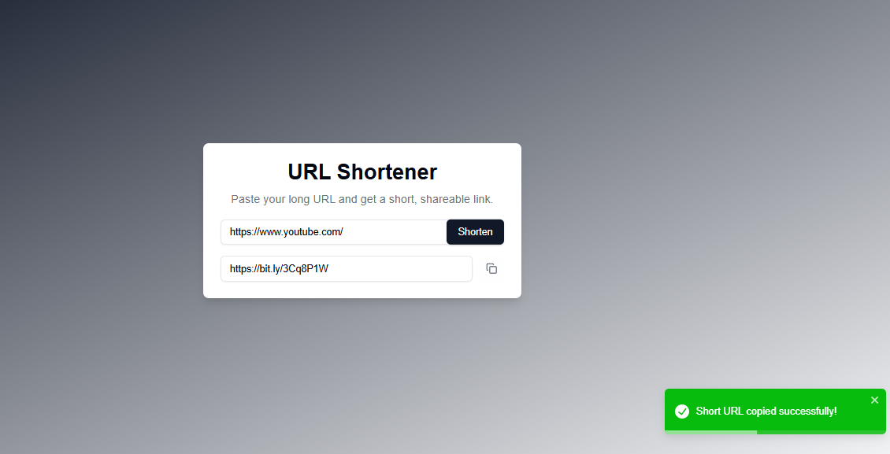

# URL Shortener

A simple and elegant URL shortener application built with **Next.js**, **React**, and **Bitly API**. This app allows users to shorten long URLs into compact, shareable links and provides a smooth user experience with modern UI and responsive notifications.

---

## 🚀 Features

- **Effortless URL Shortening**: Paste any long URL to generate a short, shareable link.
- **Copy-to-Clipboard**: Quickly copy the shortened URL with a single click.
- **Mobile-Responsive**: Fully optimized for mobile and desktop users.
- **Toast Notifications**: Get notified with visually appealing alerts for success or error states.
- **Modern Design**: Sleek and minimal UI, styled with Tailwind CSS.

---

## 🛠️ Tech Stack

- **Next.js**: Framework for server-side rendering and static site generation.
- **React**: Frontend library for building UI components.
- **Tailwind CSS**: Utility-first CSS framework for styling.
- **Bitly API**: Third-party API for URL shortening.
- **React-Toastify**: Library for beautiful notifications.

---

## 🌐 Live Demo

Check out the live app here: [**URL Shortener**](https://url-shortener-app-iota.vercel.app/)  

---

## 🖥️ Getting Started

Follow these instructions to set up and run the project locally.

### Prerequisites
- Node.js and npm installed.
- Bitly API account and an **Access Token**.

---

### Installation

1. **Clone the repository**:
   ```bash
   git clone https://github.com/Sheikh-Muhammad-Mujtaba/url-shortener.git
   cd url-shortener
   ```

2. **Install dependencies**:
   ```bash
   npm install
   ```

3. **Create `.env` file**:
   Add your Bitly API Access Token in the `.env` file:
   ```
   NEXT_PUBLIC_BITLY_ACCESS_TOKEN=your-bitly-access-token
   ```

4. **Run the development server**:
   ```bash
   npm run dev
   ```

5. **Open in browser**:
   Visit `http://localhost:3000`.

---

## 📷 Screenshots

### Home Page
  

---

## 🧪 Usage

1. Enter a long URL in the input field.
2. Click the **Shorten** button.
3. Copy the shortened URL using the **copy button** or click the link to verify.

---